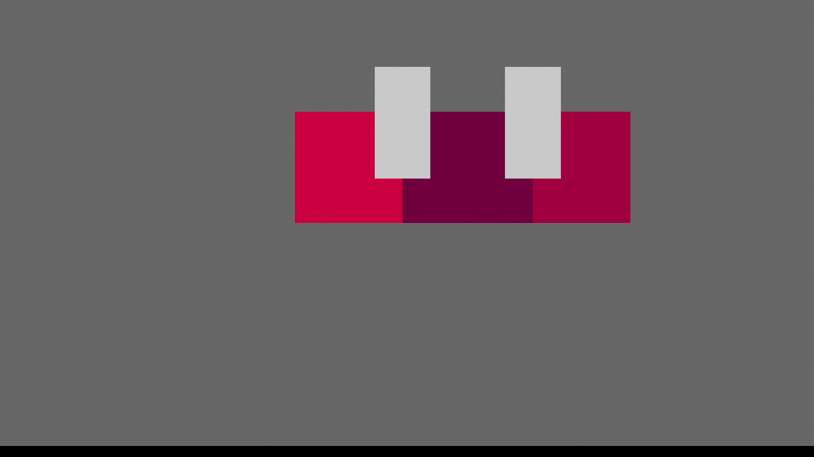

# vector

This is a small script to create drag resizable elements in a UI.

E.g. a limited game resource and you want to have a UI element to allocate that limited resource between multiple outputs.

